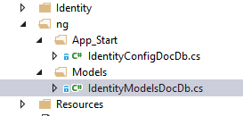

[Home](../README.md "Home")
# Installing without nuget package #
The following are the steps to get this implementation up and running without the nuget package.

## Installing ##

### Basic Project Creation ###
1. First, create your ASP.NET project using the ASP.NET Web Project template in Visual Studio
1. Choose 'MVC' and ensure the Authentication is set to **Individual User Accounts**
### Update Project Files with "Identity" class files ###

1. Once you've created your Web Application project, we just need to mark 2 files in the existing project, then copy over 2 files from this solution.
**NOTE**: this WILL be done via Nuget packaging in the near future.
> 
>     <ProjectDir>\App_Start\IdentityConfig.cs
>     <ProjectDir>\Models\IdentityModels.cs
    

*Mark as "None" for Compile Action*

2. Copy the 2 Source files: 
From THIS repo, copy each to their respective directory.  While it doesn't really matter where in the project, for convention they go in \App_Start & \Models respectively.

>     DocumentDBIdentity\src\DX.TED.DocumentDb.Identity\ng\App_Start\IdentityConfigDocDb.cs
>     DocumentDBIdentity\src\DX.TED.DocumentDb.Identity\ng\Models\IdentityModelsDocDb.cs

3. Fixup the Namespace issues (again, Nuget package will do this in the future)..
   The Namespaces in the 2 source files can just be changed to the default namespace of the project, with the Models item having ".Models" as the suffix of it's namespace.
